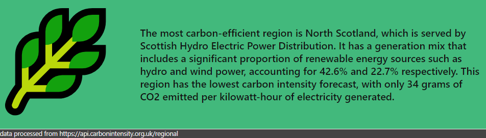
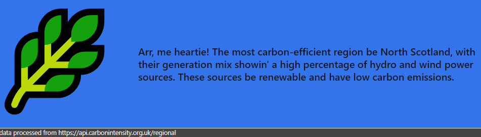

# ChatGPT powered Carbon API Summary Webpart

## Summary

Demo webpart showing how we can use ChatGPT to process data from an external API. In this case we are using the Carbon Intensity API provided by https://carbonintensity.org.uk/

## Used SharePoint Framework Version

## Applies to

- [SharePoint Framework](https://aka.ms/spfx)
- [Microsoft 365 tenant](https://docs.microsoft.com/en-us/sharepoint/dev/spfx/set-up-your-developer-tenant)

> Get your own free development tenant by subscribing to [Microsoft 365 developer program](http://aka.ms/o365devprogram)

## Prerequisites

This webpart uses the API provided by openai.com to work with solutions which use ChatGPT. As such you will need to create an openai account from [openai](http://openai.com) and generate an API key.

## Version history

| Version | Date             | Comments        |
| ------- | ---------------- | --------------- |
| 1.0     | July 26, 2023    | Initial release |

## Disclaimer

**THIS CODE IS PROVIDED _AS IS_ WITHOUT WARRANTY OF ANY KIND, EITHER EXPRESS OR IMPLIED, INCLUDING ANY IMPLIED WARRANTIES OF FITNESS FOR A PARTICULAR PURPOSE, MERCHANTABILITY, OR NON-INFRINGEMENT.**

---

## Minimal Path to Awesome

- Clone this repository
- Ensure that you are at the solution folder
- Update the CarbonApiSummaryWebPart.manifest with you openai key and organisation (can be done later in the webpart properties if needed).
- in the command-line run:
  - **npm install**
  - **gulp serve**

## Features

Description of the extension that expands upon high-level summary above.

This extension illustrates the following concepts:

- How to get data from an exteranl API in an SPFX webpart
- How to integrate openai's API into an SPFX webpart
- How to use ChatGPT to query data

The webpart was designed to read data from a carbon intensity api but will work with pretty much any anonymous api.

If you like you can also configure it to talk like a pirate!

> Share your web part with others through Microsoft 365 Patterns and Practices program to get visibility and exposure. More details on the community, open-source projects and other activities from http://aka.ms/m365pnp.

## References

- [Getting started with SharePoint Framework](https://docs.microsoft.com/en-us/sharepoint/dev/spfx/set-up-your-developer-tenant)
- [Building for Microsoft teams](https://docs.microsoft.com/en-us/sharepoint/dev/spfx/build-for-teams-overview)
- [Use Microsoft Graph in your solution](https://docs.microsoft.com/en-us/sharepoint/dev/spfx/web-parts/get-started/using-microsoft-graph-apis)
- [Publish SharePoint Framework applications to the Marketplace](https://docs.microsoft.com/en-us/sharepoint/dev/spfx/publish-to-marketplace-overview)
- [Microsoft 365 Patterns and Practices](https://aka.ms/m365pnp) - Guidance, tooling, samples and open-source controls for your Microsoft 365 development
